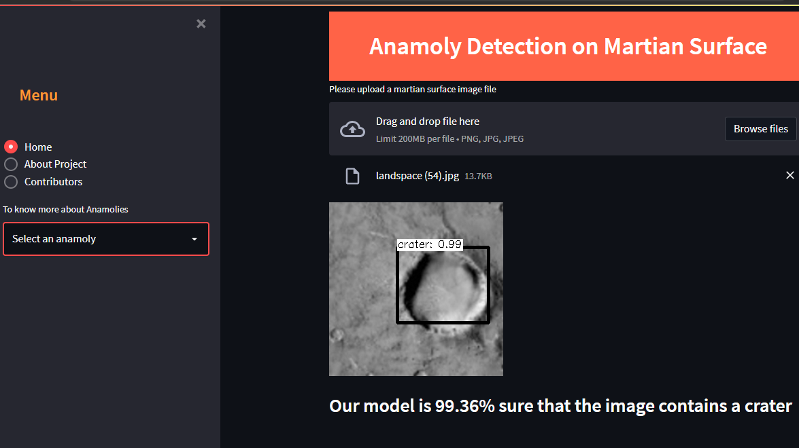

# Anamoly Detection on Martian Surface

# task-5-model-deploymen Folder/file Structure

    ├── task-5-model-deployment    <- Files related to deployment for this project
        │
        ├── Anamolies-images       <- Finalized Anamolies images for this project
        │   
        ├── app.py                 <- Streamlit app code of this project.
        │
        ├── obj.names              <- This file contains Output labels. 
        │
        ├── object_detection.py    <- This python script is used for object detection.
        │
        ├── requirements.txt    <- This file includes all libraries that needs to to be installed to run this project.
        │
        |__ packages.txt      <- This file contains all the neccessary packages for this project.
        |
        |__ yolov4-custom.cfg  <- This is yolov4 custom configuration file used for objection detection.
        |
        |__ yolov4-custom.weights <-This is yolov4 custom wieghts file used for objection detection.
        |
        └── .jpg/jpeg          <- All the image files that are used in the deployment of our App.
        
        
# Object Detection with Yolo v4 and Streamlit

Paper YOLO v4: https://arxiv.org/abs/2004.10934

You should download 'yolov4.weights' file 245 MB: [yolov4.weights](https://github.com/AlexeyAB/darknet/releases/download/darknet_yolo_v3_optimal/yolov4.weights) (Google-drive mirror [yolov4-custom.weights](https://drive.google.com/file/d/1WILkhO44xp7jFydZjm9e3cP6p5u5Ufuq/view?usp=sharing))

## Object Detection

## Start Streamlit
Type below on your terminal to run Streamlit and check the result of object detection with Streamlit.
~~~
streamlit run app.py
~~~

## For the deployment of our model we have used [Streamlit](https://docs.streamlit.io/).
Streamlit is an open-source Python library that makes it easy to create and share beautiful, custom web apps for machine learning and data science.

## Deplyoment steps:
           
- **Create an account in streamlit(if already exists click on login)**
           
- **Add your app to GitHub** :
             Streamlit Cloud launches apps directly from your GitHub repo, so your app code and dependencies need to be on GitHub before you try to deploy the app.
             See [App dependencies](https://docs.streamlit.io/streamlit-cloud/get-started/deploy-an-app/app-dependencies) for more information.
           
- **Deploy your app** : 
             To deploy an app, click "New app" from the upper right corner of your workspace, then fill in your repo, branch, and file path, and click "Deploy". 
              As a shortcut, you can also click "Paste GitHub URL".

- **Advanced settings for deployment** :
              If you are connecting to a data source or want to select a Python version for your app, 
              you can do that by clicking "Advanced settings" before you deploy the app.
              You can connect to private data sources either by using secrets management or with IP allowlisting. 
              Read more on how to [connect to data sources](https://docs.streamlit.io/streamlit-cloud/get-started/deploy-an-app/connect-to-data-sources).

- **Watch your app launch** :
             Your app is now deploying and you can watch while it launches. 
             Most apps take only a couple of minutes to deploy, but if your app has a lot of dependencies it may take some time to deploy the first time. 
             After the initial deployment, any change that does not touch your dependencies should show up immediately.

- **Your app URL**
            That's it — you're done! Your app now has a permanent URL that you can share with others. 
            Click [here](https://docs.streamlit.io/streamlit-cloud/get-started/deploy-an-app) to read about how to share your app with viewers.
            App URLs follow a standard structure based on your GitHub repo

          https://share.streamlit.io/[user name]/[repo name]/[branch name]/[app path]

## To view Anamoly Detection on Martian Surface App :[Click here](https://share.streamlit.io/hardiktejani/mars_ana/app.py)
  

## Contributors:

-[Tanisha Banik](https://www.linkedin.com/in/tanisha-banik-04b511173/)

-[Harshal Hirpara](https://www.linkedin.com/in/harshaljhirpara/)

-[Venkata Narayana Bommanaboina](https://www.linkedin.com/in/bvnarayana515739/)

-[Girish Sahu](https://www.linkedin.com/in/girishsahu)

-[Shreya Chawla](https://www.linkedin.com/in/shreyachawla1998/)

-[Chittor Vamsi](https://www.linkedin.com/in/vamsi-chittoor-331b80189)

-[Hardik Tejani](https://www.linkedin.com/in/hardik-tejani)

-[Kanak Tekwani](https://www.linkedin.com/in/kanak-tekwani/)

-[Adish Golechha](https://www.linkedin.com/in/adish-golechha)

-[Avinash Das](https://www.linkedin.com/in/avinash-das-794b4b179/)

-[Larry Pallozzi](https://www.linkedin.com/in/larry-pallozzi/)

## Project Manager:

-[Toshita Sharma](https://www.linkedin.com/in/toshita-sharma-79894a1a4/)
